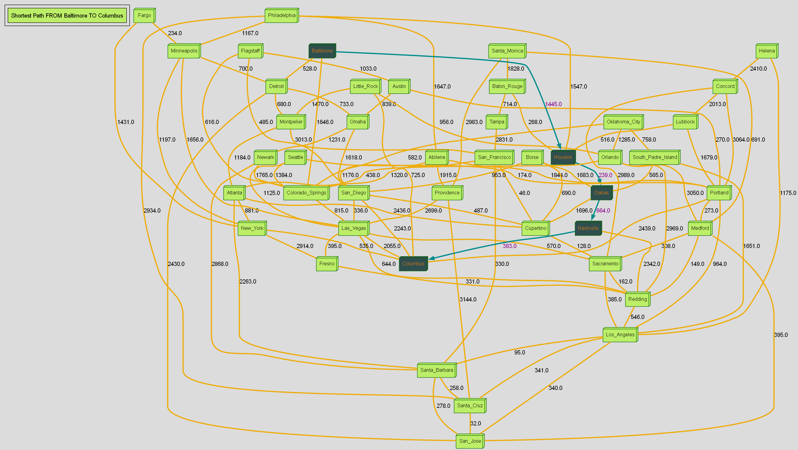

# Project Description

This project was developed with the intent to build upon [a previously-made console application](https://github.com/parsokev/graph_repo) that generates
graphical images from user-provided text files. This project provides a graphical user interface (GUI) with the same functionality as the
previous application to increase program accessiblity.

This was achieved through the utilization of:
   - [Qt Creator](https://doc.qt.io/qt-6/qt-intro.html) to develop an interactive cross-platform desktop application window that accepts user-requested
      graphical solutions from a graph whose edges are described in each separate line within a text file selected by the user.

   - [Graphviz](https://www.graphviz.org/) to visualize the submitted graphical information, along with the requested solution, in PNG-formatted images.

Upon completing the required steps for project setup outlined in the [Project Setup section](#project-setup),
the application will generate a desktop application window that will allow the user to generate and view
graphical visualizations after completing the following steps:

 1. Select a local text file providing graphical information to be processed/visualized in terms of individual edges.
    - Each separate line describes a unique edge found in the graph in the format of 
    ```
        vertex1, vertex2, distance-between-verticies
    ```
> [!NOTE]
> Example text files can be found in the [sample_graphs](./sample_graphs) directory.

> 

2. Either manually enter an estimated number of verticies for the graph or request for the program to automatically estimate the number.

    

3. Select whether the program should visualize the Minimum Spanning Tree or shortest path between two specified verticies, using the text file.

    

4. Upon confirmation of these, the project will generate the visualizations of both the graph depicted in the text file and that of the requested
   graphical solution overlaying the original graph. Upon determining the requested solution, the program will display a detailed overview of the generated
   solution information in a separate prompt window,and then begin image generation upon user-acknowledgment of the prompt information(clicks 'OK' button).

    
    
    The generated images will be immediately viewable through clicking the buttons within the application window but can also be viewed in higher
    quality within their default local save location within the [graph_images](./graph_images) directory. They will be saved upon generation but
    will be overwritten upon processing a new text file or changing the requested solution type.

# Project Setup

> [!IMPORTANT]
> In order to reduce file size and maintain local-machine compatibility, the Graphviz directory has been omitted from the repository.
> Please download the most stable ZIP-archived version that is compatible with your local machine from the [download page for Graphviz](https://www.graphviz.org/download/),
> and place the extracted contents(excluding the main folder itself) directly into the cloned repository's [Graphviz directory](./Graphviz).
> This will eliminate the need to complete local setup/installation of Graphviz on the local machine while still allowing for its use by the application.

If wishing to clone this repository to your local machine, this application must be built ***using [QT Creator](https://doc.qt.io/qtcreator/index.html)
or [Visual Studio](https://visualstudio.microsoft.com/) with [VS QT Tools](https://doc.qt.io/qtvstools/index.html) installed and enabled***.
This allows for the generation of an application executable that is compatible with the local machine's OS.


## Setting Up the Project Build Path

Regardless of which IDE is utilized to build the program, the program was developed with the intention of using two key build paths
that are dependent on the user's intended use for the program.

The program offers the option for the user to either:

1. Build the program to run locally for debugging/testing/modification purposes when using the preset configurations for either **'Debug'**
   **or 'RelWithDebInfo' (Release With Debug Info)**
   
    For use of the program under these conditions, the build path **must adhere to the following relative path from the root directory**:
        
```
    <repo-root-directory>\build\<your-configuration-name-here>
```

> [!NOTE]
> CMakeLists and resource paths are configured to be set according to the CMake Build Type so ***ensure the CMake build path follows the path above and
> the CMake Build Type is either 'Debug' or 'RelWithDebugInfo'(Release with Debug Information) and NOT 'Release' if wishing to build for local usage purposes***
>
>
> The [build directory](./build) within the repo was intentionally left empty to provide expected location of build directory within the path represented above.
> The repository tree should follow the below image (some directories are not shown in image)

> 


2. Build the program to be deployed to specific directory as a stand-alone application executable that can be run without the IDE using the
   preset configuration for **'Release' exclusively**
   
    For use of the program under these conditions, the build path **must adhere to the following relative path from the root directory**:
    
```
<repo-root-directory>\<deployed-app-directory-here>
```

> [!NOTE]
> The [App directory](./App) within the repo was intentionally left empty to provide expected location of deployment directory within the path represented above.
> CMakeLists and resource paths are configured to be set according to the CMake Build Type so ***ensure the CMake build path for the 'Release' Configuration follows the***
> ***path above if wishing to deploy the application executable along with all required runtime and Qt dependencies*** 
>
> 
> It should also be noted that the .png files stored in the 'graph_images' directory and .gv files stored in the 'dot_graphs' directory will be modified in each
> successive execution of the application. This may be flagged by a device's anti-virus software if transferred to a different device when application is executed.
> **To prevent this from occurring, delete all previously generated files from these two directories before transferring to a different device**.
>
>
> Upon completion of build process, the directory in which the app was deployed can be executed locally without the programs required to build/run the application 
> by simply double clicking the .exe file within the directory


## Setting Up Project Using QT Creator

Setting up the program using Qt Creator after cloning the repository can be completed by either:
1. Modifying the CMake Preset Configurations gathered from the `CMakeUserPresets.json` file by Qt automatically to have the expected build paths
   for the different configurations to be automatically set by these imported preset configurations.

2. Ignoring the Preset Configurations offered by Qt upon cloning the repository and simply modifying the build paths to their expected values for the
   for each configuration path that will be generated by Qt Creator upon request.

### Option 1: Modifying the CMake Preset Configurations

After cloning the repository, Qt Creator will gather the configuration presets listed in the `CMakeUserPresets.json` file and offer these upon intial setup window.
These will be listed as:
A. `Qt-Debug` configuration which will set the expected build path for localized testing/execution of the program.
B. `Qt-Release` configuration which will set the expected build path for deploying the application as a stand-alone executable

In order to make the configuration compatible with the local machine the additional information has been ommitted and must be manually applied to each preset separately
This can accomplished by:
1. Clicking the `Details` tab that appears under each of these presets to manually select the options for setting local build compatibility
2. Selecting the preferred `CMake Generator` option from the dropdown list (Ex: 'Ninja')
3. Selecting the preferred `Debugger` option from the dropdown list (Ex: GNU gdb)
3. Selecting the preferred `Compiler` option for both C and C++ compilers from the dropdown lists (Ex: MingGW for C,C++)
4. Selecting the preferred `Qt Version` option from the dropdown list (Ex: Qt Version 6.8.0)
5. Clicking `Apply` to set these to the imported configuration

If uncertain of any of these options, the preset values for kits offered by Qt automatically will have the options offered by Qt itself.
    
Upon configuring both configurations, either can be built with the build paths set to the expected paths and executed immediately.

### Option 2: Modifying the Qt-Generated Preset Configurations

Qt will automatically provide kits that will have all the CMake settings optimized with the resources Qt provides for building locally.
These must be generated using Qt and then the build path must be changed to adhere to expected build path for the intended program utilization.
This can be accomplished by:

1. Selecting the `Projects` tab from the left-hand menu bar
2. Selecting a kit that is compatible with the local machine's OS can be configured by clicking the `Manage Kits` button within the `Projects` page and choosing
for the selection of available kits presented.
3. Changing the build path to match the path syntax listed above according the `CMAKE_BUILD_TYPE` value of the kit configuration by clicking the `Manage` button.

This should be sufficient to build the project using CMake. Further information on this process can be found [here](https://doc.qt.io/qtcreator/creator-how-to-activate-kits.html).

Upon completion of build process, the application will display the application window for accepting requests upon being executed. The most recently generated images
will be stored within the [graph_images](./graph_images) directory (they will be overwritten upon next execution if not copied and stored elsewhere locally)


## Setting Up Project using Microsoft Visual Studio

Upon cloning the repository, VS will most likely immediately request to modify `CMakeUserPresets.json` file after VS QT Tools extension detects the project is
a Qt project to include the provided paths to required Qt Components/Resources to the CMake Build settings. 

Upon completion, the build paths originally provided in the `CMakeUserPresets.json` should allow for immediate
selection/building of the configurations with the correct associated build paths.

Before building either of the configurations:

1. Ensure the compiler path is set correctly.
     - The VS QT Tools extension will most likely prompt for configuring the project upon recognizing the Qt Project and will most likely
        alter the provided the `CMakeUserPresets.json` file to include the provided paths to required Qt Components/Resources but not the compiler settings
     - Select the `Extensions` tab -> `Qt Tools` -> `Qt Versions`
     - If no compiler profile is set, click `Autodetect` and see if a compiler profile is generated. This should be set to MVSC with a path to qmake.exe
    
Upon ensuring the Qt Resources are correctly linked to the CMake variables the preset configurations can be built and the program executred using VS.

# Sample Generated Images

A gallery of pre-generated graph images can be found in the [graph_images](./graph_images) directory, which were generated
to show visualizations of lower density graphs using [my_graph5.txt](./sample_graphs/my_graph5.txt) and of higher density graphs
using [my_graph6.txt](./sample_graphs/my_graph6.txt) both of which can be found in the [sample_graphs directory](./sample_graphs)

> [!CAUTION]
> When building visualizations for graphs with higher edge densities like `my_graph6.txt`, it may take several minutes for the
> visualization software to complete the image generation process. In such cases, the detailed progress of the visualization process can
> be monitored through standard error ouput in the console

Example Image Generated from `my_graph5.txt`



# Additional Resources

## Build Graphs using GoogleMaps API and the provided Python script

The `main.py` file found in the [py_builder directory](./py_builder) was utilized for testing and generating graph text files
while using the GoogleMaps API to provided simplified distance data between geographic locations. The `main.py` file can be used to:

1. Generate the maximum number of unique edges that can be generated from a list of city names using the `create_max_edges` function
2. Parse an existing text file with a list of edges (where each line follows format of `city1, city2, `) and have the rough distance
   between the two existing city locations (requested from [GoogleMaps' DistanceMatrixAPI](https://developers.google.com/maps/documentation/distance-matrix)
   ) written at the end of the edge for all edges with valid locations. 

If wishing to use this, please visit [the DistanceMatrixAPI homepage](https://developers.google.com/maps/documentation/distance-matrix) to
create an account and generate the API key needed to make requests with the program. For the requests made by the program, the cost for such requests will
be virtually free and free trials with GCP credits are available for new accounts.

# Citations

Third Party Software/Libraries Utilized in Building this Project Include:

- [Graphviz](https://www.graphviz.org/license/)

- [Qt](https://www.qt.io/licensing/open-source-lgpl-obligations#lgpl)

In accordance with the wishes of Qt and Graphviz, the LGPLv3 license has been included with this repository and the links to the
license agreements for both Graphviz and Qt are provided above.
