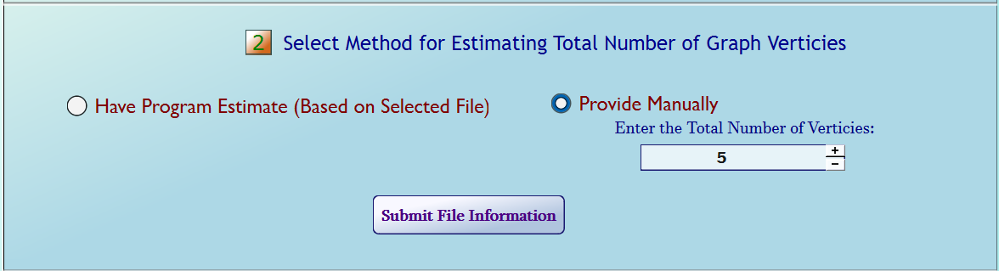
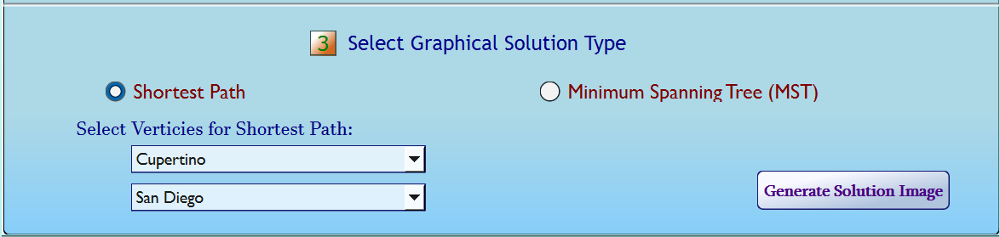
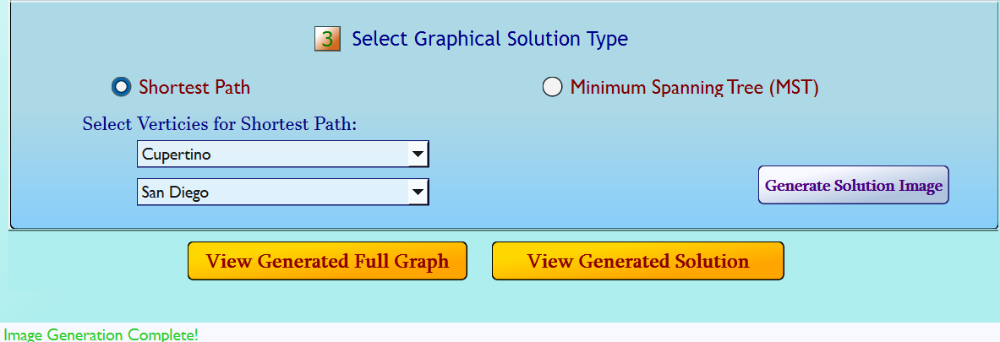

# Project Description:

This project was developed with the intent to convert [a previous application](https://github.com/parsokev/graph_repo) that generates graphical images 
from user-provided text files strictly through interaction with a command console into a graphical user interface (GUI) that provides the same functionality.

This was achieved through the utilization of:
   - [Qt Creator](https://doc.qt.io/qt-6/qt-intro.html) to develop an interactive cross-platform desktop application window that accepts user-requested
      graphical solutions from a graph
      whose edges are described in each separate line within a text file selected by the user.

   - [Graphviz](https://www.graphviz.org/) was utilized to visualize the submitted graphical information, along with the requested solution, in PNG-formatted images.

Upon completing the required steps for project setup outlined in the [Project Setup section](#project-setup),
the application will generate a desktop application window that will allow the user to:
> [!NOTE]
> Example text files can be found in the [sample_graphs](./sample_graphs) directory

 1. Select a local text file providing graphical information to be processed/visualized in terms of individual edges.
    - Each separate line describes a unique edge found in the graph in the format of 
    ```
        vertex1, vertex2, distance-between-verticies
    ```

    

2. Either manually enter an estimated number of verticies for the graph or request for the program automatically estimate the number

    

3. Select whether the program should visualize the Minimum Spanning Tree or shortest path between two specified verticies, using the text file

    

4. Upon confirmation of these, the project will generate the visualizations of both the graph depicted in the text file and that of the requested
   graphical solution overlaying the original graph and allow the user to select and view these images after generation

    


# Project Setup

> [!IMPORTANT]
> In order to reduce file size and maintain local-machine compatibility, the Graphviz directory has been omitted from the repository.
> Please download the most stable ZIP-archived version that is compatible with your local machine from the [download page for Graphviz](https://www.graphviz.org/download/),
> and place the extracted contents(excluding the main folder itself) directly into the cloned repository's [Graphviz directory](./Graphviz).
> This will eliminate the required installation of Graphviz on the local machine while still allowing for its use by the application.

If wishing to clone this repository to your local machine, this application must be built **using QT Creator or Visual Studio with QT extensions installed and enabled**.
This allows for the generation of an application executable that is compatible with the local machine's OS.

Once the repository has been cloned locally using either platforms, set the application's build directory path to mirror the path outlined below
and ensure the CMake build kit is configured to be compatible with local machine's OS:

```
<root-directory>\build\<your-kit-name-here>
```

> [!NOTE]
> The [build directory](./build) within the repo was intentionally left empty to provide expected location of build directory within the path represented above.

> Implementing the build path in QT Creator can accomplished by by selecting the `Projects` tab from the left-hand menu bar and adjusting the build directory
> to match the path syntax.
> Selecting a kit that is compatible with the local machine's OS can be configured by clicking the `Manage Kits` button within the `Projects` page and choosing
> for the selection of available kits presented.
> This should be sufficient to build the project using CMake. This process using Visual Studio is accomplished in a similar fashion.
> Further information on this process can be found [here](https://doc.qt.io/qtcreator/creator-how-to-activate-kits.html).

Upon completion of build process, the application will display the application window for accepting requests upon being executed. The most recently generated images
will be stored within the [graph_images](./graph_images) directory (they will be overwritten upon next execution if not copied and stored elsewhere locally)

# Deploying Executable

If wishing to deploy this application, Qt provides ability to deploy an application that can be executed locally without requiring Visual Studio or Qt Creator.
This can used through the Qt command-line tool by the following steps:
1. Copy the generated MyProjectName.exe file and paste it within an empty directory
2. Initialize the Qt command-line tool and navigate to the directory containing the .exe file
3. Enter the command ```windeployqt MyProjectName.exe .```

> [!NOTE]
> Remember to have the directory hierarchy mirror that of the cloned repository and copy all folders found in root directory
> Place .exe file in alignment with place of GraphImaging_UI, where 'Debug_Qt_...' is the kit directory within the build directory


# Citations:
Third Party Software/Libraries Utilized in Building this Project Include:

- [Graphviz](https://www.graphviz.org/license/)

- [Qt](https://www.qt.io/licensing/open-source-lgpl-obligations#lgpl)
